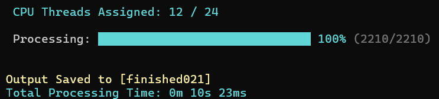

# Wavify

[](https://ffmpeg.org/)
[](https://github.com/OnlyCat11/wavify/releases/latest)

> An FFmpeg-based CLI tool for preprocessing audio datasets

> FFmpeg 기반 CLI 오디오 데이터셋 전처리 도구

[English](#english) | [한국어](#korean)

<a id="english"></a>

---

# English

## Features

- **Audio Standardization:** Converts audio and video formats to WAV (`48kHz`, `PCM 16-bit`, `Mono`).

  <details>
  <summary><b>Supported Formats</b></summary>

  `wav` `mp3` `flac` `ogg` `opus` `m4a` `mp4` `aac` `alac` `wma` `aiff` `webm` `ac3`

  </details>

- **Automated Pipeline:** Processes all files in batch and automatically creates a result folder such as `finished001`. Output files are sequentially indexed (e.g., `01.wav`).
- **Parallel Processing:** Automatically assigns half of the available CPU threads to process multiple files simultaneously.
- **Real-time Progress Monitoring:** Displays a colored progress bar, processing status, and assigned CPU threads in the PowerShell console, along with the total processing time upon completion.



- **Verification:** Includes checks for FFmpeg installation, input file existence, and duplicate result folder prevention. Conversion errors and timeouts are collected and reported upon completion.

## Requirements

- **OS:** Windows 10 / 11 (recommended, tested on Windows 11 25H2)
- **PowerShell:** Windows PowerShell 5.1 or later
- **.NET Framework:** 4.0 or later (pre-installed on Windows 10/11)
- **Dependencies:** [FFmpeg](https://www.ffmpeg.org/) (recommended to add it to the system PATH)

## Installation

Download from the [Release](https://github.com/OnlyCat11/wavify/releases/latest) page.

**or**

Clone the repository:

```bash
git clone https://github.com/OnlyCat11/wavify.git
```

## Usage

1. Put the files you want to preprocess in the same folder as the script.
2. Run `run.bat`.

## Example

**Input**

- file1.wav
- file2.mp3
- video1.mp4

**Output**
finished001/

- 01.wav
- 02.wav
- 03.wav

## Project Structure

```text
wavify/
├── run.bat                             # Entry point: Executes the preprocessing pipeline
├── wavify.ps1      # Main logic (Requires FFmpeg): Handles conversion & batching
├── wavify-ui.png   # Screenshot of UI / PowerShell console progress
├── README.md                           # Project documentation
├── LICENSE                             # License file (MIT)
└── .gitignore                          # Git ignore rules
```

---

<a id="korean"></a>

# 한국어

## 주요 기능 (Features)

- **Audio Standardization:** 오디오 및 비디오 포맷을 WAV (`48kHz`, `PCM 16-bit`, `Mono`)으로 변환합니다.

  <details>
  <summary><b>지원 포맷</b></summary>

  `wav` `mp3` `flac` `ogg` `opus` `m4a` `mp4` `aac` `alac` `wma` `aiff` `webm` `ac3`

  </details>

- **Automated Pipeline:** 모든 파일은 일괄로 처리하며, 해당 폴더 안에 `finished001`과 같은 결과 폴더를 자동 생성합니다. 결과 파일 이름은 `01.wav`와 같이 순차적으로 인덱싱됩니다.
- **Parallel Processing:** 가용 CPU 스레드의 절반을 자동으로 할당하여 여러 파일을 동시에 처리합니다.
- **Real-time Progress Monitoring:** PowerShell 터미널에서 컬러 Progress Bar, 진행률, 할당된 CPU 스레드 수를 표시합니다. 또한 완료 시 총 처리 시간도 출력됩니다.


- **Verification:** FFmpeg 설치 여부, 입력 파일 존재 확인 및 결과 폴더 중복 방지 로직을 포함합니다. 변환 실패 및 타임아웃 에러는 완료 시 일괄 출력됩니다.

## 요구 사항 (Requirements)

- **OS:** Windows 10 / 11 (권장, Windows 11 25H2 환경에서 테스트됨)
- **PowerShell:** Windows PowerShell 5.1 이상
- **.NET Framework:** 4.0 이상 (Windows 10/11에 기본 내장됨)
- **Dependencies:** [FFmpeg](https://www.ffmpeg.org/) (설치 시, 환경 변수 PATH 등록 권장)

## 설치 방법 (Installation)

[Release](https://github.com/OnlyCat11/wavify/releases/latest) 페이지에서 다운로드합니다.

**또는**

저장소를 클론합니다.

```bash
git clone https://github.com/OnlyCat11/wavify.git
```

## 사용법 (Usage)

1. 전처리할 파일들을 스크립트와 같은 폴더에 넣습니다.
2. `run.bat`를 실행하세요.

## 예시 (Example)

**입력**

- file1.wav
- file2.mp3
- video1.mp4

**출력**
finished001/

- 01.wav
- 02.wav
- 03.wav

## 프로젝트 구조 (Project Structure)

```text
wavify/
├── run.bat                              # 실행 파일: 전처리 파이프라인 즉시 실행
├── wavify.ps1       # 메인 로직 (FFmpeg 설치 필요): 오디오 변환 및 배치 처리 담당
├── wavify-ui.png    # 스크린샷: 인터페이스 및 진행 상황 예시
├── README.md                            # 프로젝트 설명서
├── LICENSE                              # 라이선스 파일 (MIT)
└── .gitignore                           # Git 관리 제외 대상 설정
```
